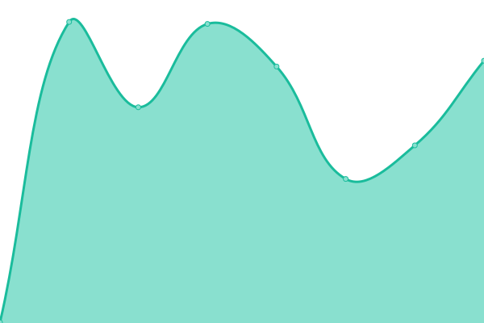
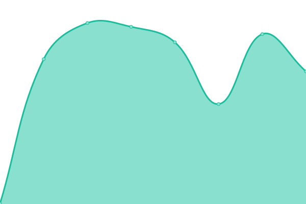
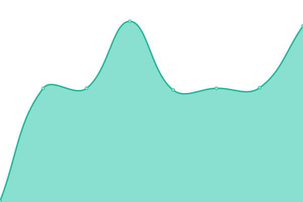

# [📈 Live Status](https://eosc-synergy.github.io/o3as-status): <!--live status--> **🟧 Partial outage**

This repository contains the open-source uptime monitor and status page for [O3as thematic service](https://o3as.data.kit.edu), powered by [Upptime](https://github.com/upptime/upptime).

With [Upptime](https://upptime.js.org), you can get your own unlimited and free uptime monitor and status page, powered entirely by a GitHub repository. We use [Issues](https://github.com/eosc-synergy/o3as-status/issues) as incident reports, [Actions](https://github.com/eosc-synergy/o3as-status/actions) as uptime monitors, and [Pages](https:///o3as-status) for the status page.

<!--start: status pages-->
<!-- This summary is generated by Upptime (https://github.com/upptime/upptime) -->
<!-- Do not edit this manually, your changes will be overwritten -->
<!-- prettier-ignore -->
| URL | Status | History | Response Time | Uptime |
| --- | ------ | ------- | ------------- | ------ |
|  [O3as main website](https://o3as.data.kit.edu) | 🟩 Up | [o3as-main-website.yml](https://github.com/EOSC-synergy/o3as-status/commits/HEAD/history/o3as-main-website.yml) | 

 806ms
     
 | 

<a href="https://EOSC-synergy.github.io/o3as-status/history/o3as-main-website">100.00%</a>
    

|  [O3as WebApp (frontend)](http://o3web.test.fedcloud.eu/) | 🟩 Up | [o3as-web-app-frontend.yml](https://github.com/EOSC-synergy/o3as-status/commits/HEAD/history/o3as-web-app-frontend.yml) | 

 507ms
     
 | 

<a href="https://EOSC-synergy.github.io/o3as-status/history/o3as-web-app-frontend">100.00%</a>
    

|  [O3as WebApp (backend)](http://o3web.test.fedcloud.eu:5000/plot) | 🟩 Up | [o3as-web-app-backend.yml](https://github.com/EOSC-synergy/o3as-status/commits/HEAD/history/o3as-web-app-backend.yml) | 

 398ms
     
 | 

<a href="https://EOSC-synergy.github.io/o3as-status/history/o3as-web-app-backend">100.00%</a>
    

|  [O3api (API endpoint)](http://o3api.test.fedcloud.eu:30505/api/ui/) | 🟥 Down | [o3api-api-endpoint.yml](https://github.com/EOSC-synergy/o3as-status/commits/HEAD/history/o3api-api-endpoint.yml) | 

 517ms
     
 | 

<a href="https://EOSC-synergy.github.io/o3as-status/history/o3api-api-endpoint">100.00%</a>
    

|  [O3api - development (API endpoint)](http://o3api.test.fedcloud.eu:30509/api/ui/) | 🟩 Up | [o3api-development-api-endpoint.yml](https://github.com/EOSC-synergy/o3as-status/commits/HEAD/history/o3api-development-api-endpoint.yml) | 

 263ms
     
 | 

<a href="https://EOSC-synergy.github.io/o3as-status/history/o3api-development-api-endpoint">100.00%</a>
    

|  [O3as documentation](https://o3as.readthedocs.io) | 🟩 Up | [o3as-documentation.yml](https://github.com/EOSC-synergy/o3as-status/commits/HEAD/history/o3as-documentation.yml) | 

 232ms
     
 | 

<a href="https://EOSC-synergy.github.io/o3as-status/history/o3as-documentation">100.00%</a>
    

<!--end: status pages-->

[**Visit our status website →**](https://eosc-synergy.github.io/o3as-status)

## 📄 License

- Powered by: [Upptime](https://github.com/upptime/upptime)
- Code: [MIT](./LICENSE) © [Project EOSC-synergy](www.eosc-synergy.eu)
- Data in the `./history` directory: [Open Database License](https://opendatacommons.org/licenses/odbl/1-0/)
